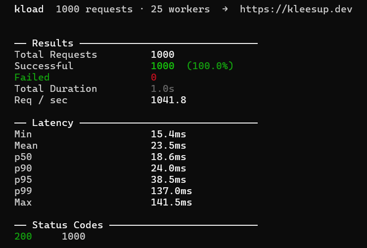

# kload
> Lightweight CLI load-testing-tool for HTTPS-Endpoints written in Go.

## About
**kload** is a lightweight HTTP load testing tool built in Go. 
It sends a configurable number of concurrent requests against an endpoint and reports back latency percentiles, 
throughput, and status code breakdowns and therefore everything you need to understand how a service behaves under pressure.

It's built with **zero** external dependencies, relying entirely on the Go standard library. 
That keeps the binary small, the build fast, and the codebase easy to audit. 

The concurrency model is a straightforward worker pool: a fixed number of goroutines pull jobs from a channel and feed 
results back through another, which makes the load behaviour predictable and the code easy to reason about.

### Why use kload?
- [x] Zero dependencies
- [x] Complete metrics (latency in min, max, mean, p50, p90, ...)
- [x] Built for both humans and pipelines
  - Readable table output for interactive use and JSON or CSV for CI integration and further analysis
- [x] Realistic load shaping 
  - Cap requests per second, run for a fixed duration or a fixed request count, and use warmup phases to exclude 
    cold-start noise from your results  

---

## Usage
By invoking the command ```kload``` the following flags can be used:

| Flag                      | Parameter type | Required | Description                                                                 | Usage example                           |
|:--------------------------|:--------------:|:--------:|:----------------------------------------------------------------------------|-----------------------------------------|
| ``-u``, ``--url``         |    ``URL``     |   Yes    | Target URL to load test                                                     | ``-u https://example.com``              |
| ``-m``, ``--method``      |    ``Text``    |    No    | HTTP method (GET, POST, PUT, PATCH, DELETE)                                 | ``-m GET``                              |
| ``-H``, ``--header``      |    ``Text``    |    No    | Request headers, repeatable                                                 | ``-H "Content-Type: application/json"`` |
| ``-b``, ``--body``        |    ``Text``    |    No    | Request body as raw string (used with POST/PUT)                             | ``-b '{"user":"test"}'``                |
| ``--body-file``           |    ``Path``    |    No    | Read request body from file instead of inline string                        | ``--body-file body.json``               |
| ``-n``, ``--requests``    |  ``Integer``   |    No    | Total number of requests to send                                            | ``-n 100``                              |
| ``-c``, ``--concurrency`` |  ``Integer``   |    No    | Total number of concurrent workers sending requests                         | ``-c 10``                               |
| ``-d``, ``--duration``    |  ``Duration``  |    No    | Run for a fixed duration instead of a fixed request count                   | ``-d 30ms``                             |
| ``-rps``                  |  ``Integer``   |    No    | Cap requests per second (useful for rate-limit testing, 0 = unlimited)      | ``-rps 30``                             |
| ``--warmup``              |  ``Integer``   |    No    | Number of warmup requests to send before measuring (results excluded)       | ``--warmup 5``                          |
| ``-t``, ``--timeout``     |  ``Duration``  |    No    | Per-request timeout                                                         | ``-t 500ms``                            |
| ``--retries``             |  ``Integer``   |    No    | Number of retries on timeout before marking as failed                       | ``--retries 3``                         |
| ``--no-redirect``         |  ``Boolean``   |    No    | Disable following HTTP redirects                                            | ``--no-redirect``                       |
| ``-o``, ``--output``      |    ``Path``    |    No    | Write results to file. Format inferred from extension (``.json``, ``.csv``) | ``-o report.json``                      |
| ``--format``              |    ``Text``    |    No    | Terminal output style (``table, json, csv, silent``)                        | ``--format table``                      |
| ``--no-progress``         |  ``Boolean``   |    No    | Hide the live progress bar                                                  | ``--no-progress``                       |
| ``-v``, ``--verbose``     |  ``Boolean``   |    No    | Print each request result individually as it completes                      | ``-v``                                  |
| ``--insecure``            |  ``Boolean``   |    No    | Skip TLS certificate verification                                           | ``--insecure``                          |
| ``--http2``               |  ``Boolean``   |    No    | Force HTTP/2 (default negotiates)                                           | ``--http2``                             |
| ``--keep-alive``          |  ``Boolean``   |    No    | Reuse TCP connections between requests                                      | ``--keep-alive``                        |

---

#### Execution examples
```
# Basic GET with 500 requests and 20 workers
kload -u https://api.example.com/health -n 500 -c 20

# POST with body, 30s run, capped at 100 rps
kload -u https://api.example.com/login \
      -m POST \
      -H "Content-Type: application/json" \
      -b '{"user":"test","pass":"test"}' \
      -d 30s --rps 100

# Export results as JSON and no progress bar (CI mode)
kload -u https://api.example.com -n 1000 -c 50 \
      --no-progress -o results.json
```

#### Output example (console)


#### Output example (JSON)
````json
{
  "total": 1000,
  "successful": 1000,
  "failed": 0,
  "req_per_sec": 1041.7580375278749,
  "total_duration_s": 0.9599158,
  "latency": {
    "max": "141.5ms",
    "mean": "23.5ms",
    "min": "15.4ms",
    "p50": "18.6ms",
    "p90": "24.0ms",
    "p95": "38.5ms",
    "p99": "137.0ms"
  },
  "status_codes": {
    "200": 1000
  }
}
````

---

## Dependencies
> No Dependencies! kload is completely dependency free and built in Go version 1.26.4.

---

## License
MIT License

Copyright (c) 2026 KleeSup

Permission is hereby granted, free of charge, to any person obtaining a copy
of this software and associated documentation files (the "Software"), to deal
in the Software without restriction, including without limitation the rights
to use, copy, modify, merge, publish, distribute, sublicense, and/or sell
copies of the Software, and to permit persons to whom the Software is
furnished to do so, subject to the following conditions:

The above copyright notice and this permission notice shall be included in all
copies or substantial portions of the Software.

THE SOFTWARE IS PROVIDED "AS IS", WITHOUT WARRANTY OF ANY KIND, EXPRESS OR
IMPLIED, INCLUDING BUT NOT LIMITED TO THE WARRANTIES OF MERCHANTABILITY,
FITNESS FOR A PARTICULAR PURPOSE AND NONINFRINGEMENT. IN NO EVENT SHALL THE
AUTHORS OR COPYRIGHT HOLDERS BE LIABLE FOR ANY CLAIM, DAMAGES OR OTHER
LIABILITY, WHETHER IN AN ACTION OF CONTRACT, TORT OR OTHERWISE, ARISING FROM,
OUT OF OR IN CONNECTION WITH THE SOFTWARE OR THE USE OR OTHER DEALINGS IN THE
SOFTWARE.

